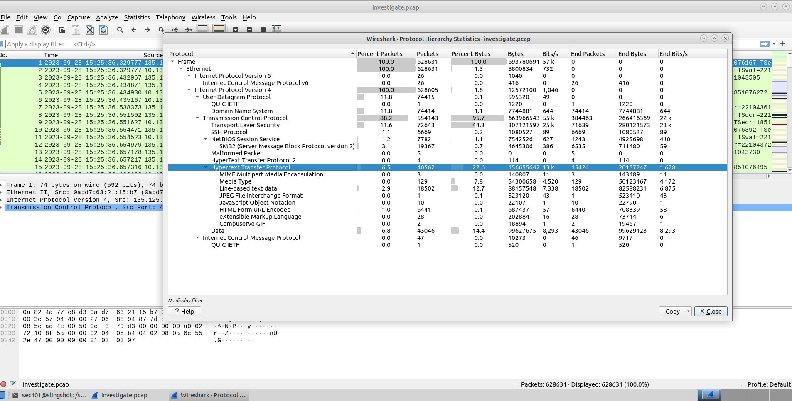
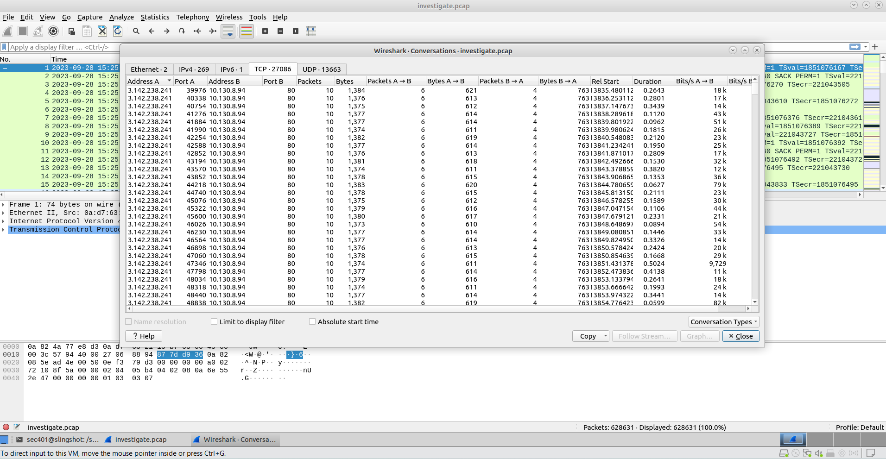
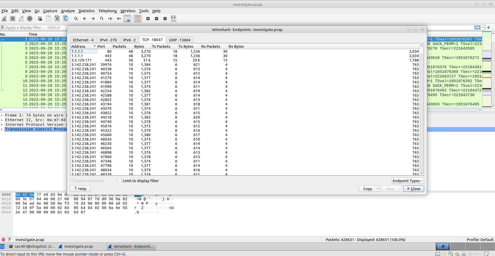
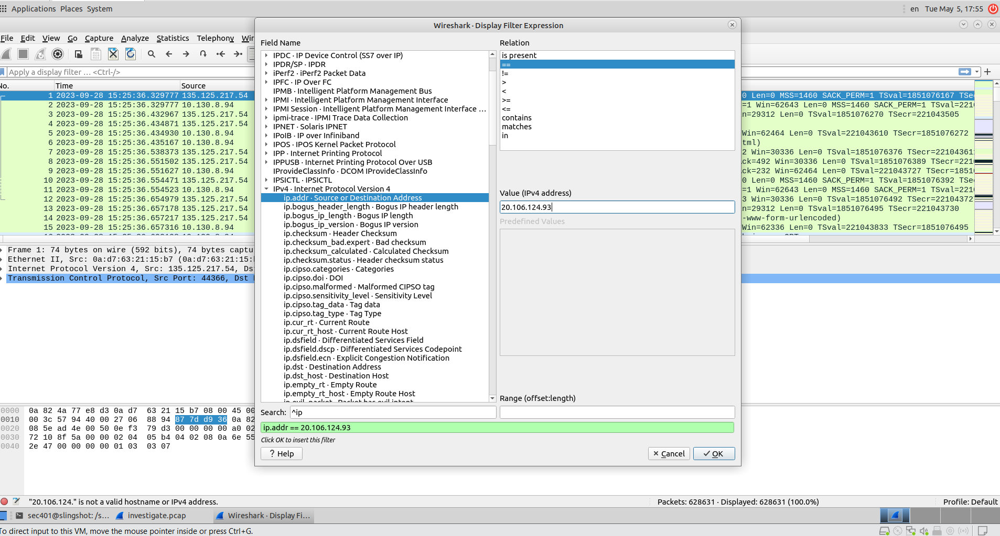
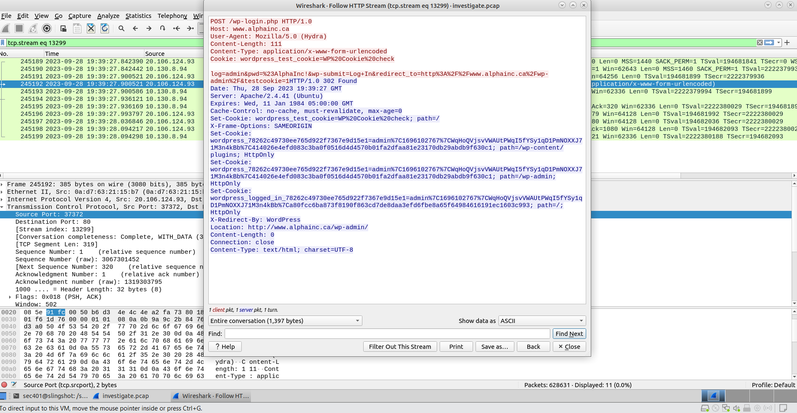
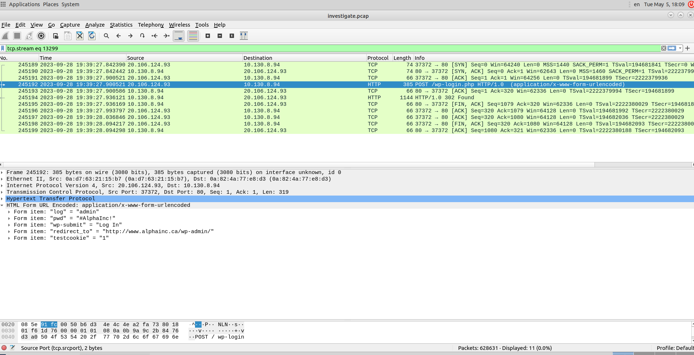
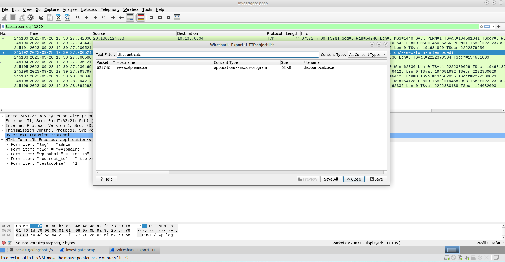
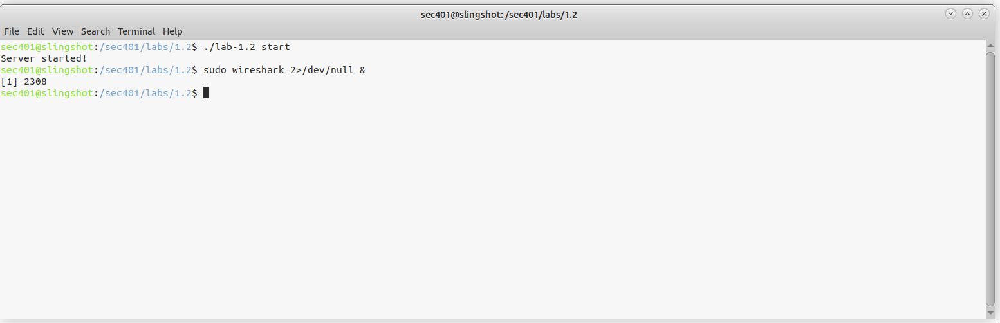
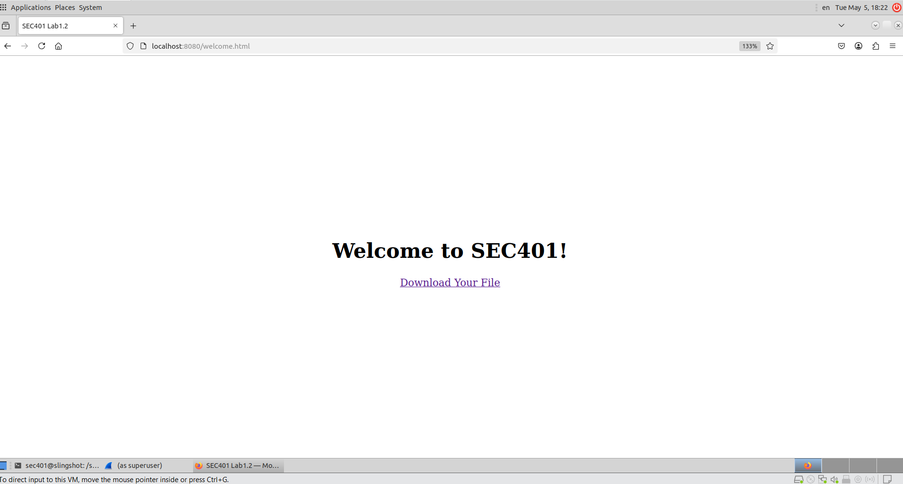
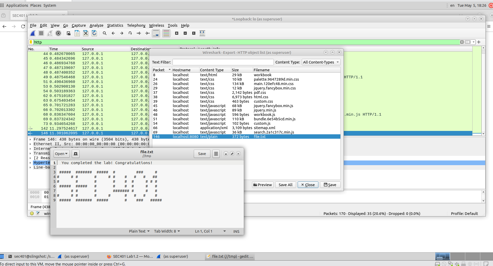

# Lab-1.2-Wireshark-Packet-Analysis

## Overview:

This lab demonstrates how to use Wireshark, a GUI-based packet analysis tool, to investigate and identify attack patterns though protocol heiracrchy and conversation statistics, and reconstruct attacker sessions using display filters and stream following.

In this scenario, I used Wireshark to investigate the PCAP file (625K-packets) obtained from the compromised web server at Alpha.Inc for a more in-depth analysis. 

## 1: Protocol Hierarchy

I Imported the investigate.pcap file into Wireshark, then examined Statistics -> Protocol Hierarchy. It revealed the traffic composition: TCP at 88.2% (554K packets) – TLS, SSH, SMB2, HTTP. UDP made up 11.8% - DNS. This gave me an overall view of the different protocols to investigate. 

## 2: Conversation Statistics

In Statistics -> Conversations -> TCP exposed a clear attack pattern. The IP: 3.142.238.241 made hundreds of short-lived connections to 10.130.8.94 on port 80 with exactly 10 packets each. This high-volume, uniform pattern is consistent with automated scanning or brute-force activity. 

## 3: Endpoint Statistics

In Statistics -> Endpoints -> TCP the top talkers were: 1.1.1.1 (host – port 80 and 443), 3.5.129.171 (port 443), and 3.142.238.241

## 4: Display Filters

I built a filter for ip.addr == 20.106.124.93. The GUI filter builder shows the vast number of fields and operators, and validates the expression before applying. This is great for creating long, complex filters, without the need of memorizing syntax. 

## 5: HTTP Stream 

Examining packet #245192: Right-click -> Follow -> HTTP Stream revealed a POST request to /wp-login from Hydra user-agent with the credentials in plaintext. The server responded with a 302 Found and a redirect to /wp-admin, confirming the successful brute-force login. 

## 6: Decoded Data Inspection

In the Packet Details Pane, Wireshark decoded the URL-encoded form body. From it, I extracted the successful credentials: log-admin, pwd=#AlphaInc!, and redirect_to = http://www.alphainc.ca/wp-admin/ 

## 7: Exporting a Suspicious Executable 

Under the File -> Export Objects -> HTTP tab, I located and exported a suspicious executable named “discount-cal.exe”, which will be investigated later. 

## 8: Capturing Live Traffic

After launching a local we server, I opened Wireshark for a live capture and supressed warnings to 2>/dev/null

Browsing to localhost:8080, a download link appeared. This generated HTTP traffic on the loopback interface for live capture analysis. 

Stopping the live capture, I analyzed the HTTP traffic, then exported the file I downloaded from the local web server. 

## Takeaways:

This lab really showed the difference between tcpdump and Wireshark. Both are used to capture and analyze network traffic, but should be used in different ways. Tcpdump works best for fast, efficient packet capturing; Wireshark for deep, interactive packet analysis. 

Following the HTTP stream was very insightful during this exercise. The 302 redirect to the admin page confirmed the attacker successfully breached the system, moving the investigation from “were we targeted (reconnaissance)” to “what did they access (initial access/persistence/lateral movement)”. 

